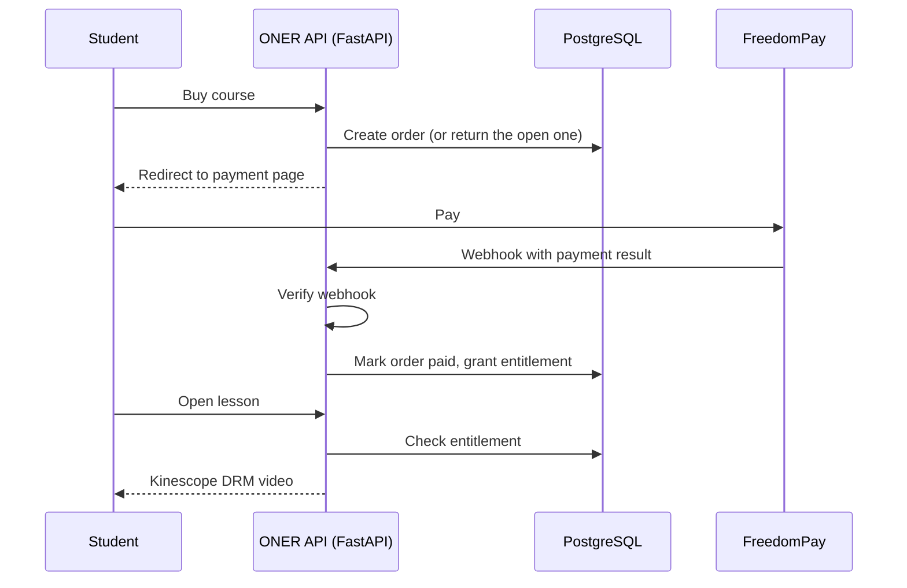
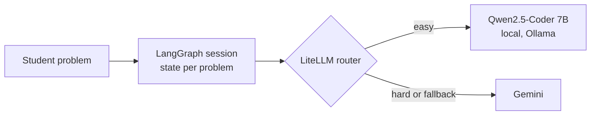

## Hi, I'm Bekzat

Software engineer in Seattle. I work mostly on backends in Python.
CS student at Bellevue College. Before software I spent four years making commercial videos, so I am used to clients, feedback and deadlines.

### What I am building

**[ONER](https://github.com/bekzat-uraimov/oner-platform)** is an online filmmaking course platform for Russian speaking Central Asia. **[Code](https://github.com/bekzat-uraimov/oner-platform)**
I built the backend with FastAPI, PostgreSQL, SQLModel and Alembic. The part that took the longest was the payment flow with FreedomPay, because a mistake there means someone gets charged twice, or gets a course they never paid for.
The rule of the whole product is simple: you watch a lesson only if you own it. Access is decided on the server, only after the payment webhook is verified. Clicking "buy" twice returns the same order, not a second charge. Video is DRM protected with Kinescope, and files are stored on Cloudflare R2.

ONER also has a full **admin panel**, and it is the only way to change content:
- build courses with modules and lessons, and publish them when ready
- upload lesson videos straight to Kinescope, the new video goes live only after processing is done
- upload course files straight to Cloudflare R2, with a sweep that cleans up files nothing uses
- find students by email, see what they bought and every payment they tried, change role or disable an account
- see all purchases and abandoned checkouts, record refunds, and give or take away access by hand

**ThinkCoder** at [akyldoo.ai](https://akyldoo.ai), an AI coding assistant. I built the Python AI orchestration layer.
LangGraph runs each problem as its own session with state, instead of one long prompt. LiteLLM sends easy requests to a local Qwen2.5-Coder model through Ollama, and the harder ones go to Gemini. This keeps the cost down.

### Hackathons

- **[Poly Predictor Kit](https://github.com/bekzat-uraimov/Poly_Predictor_Kit)**: won the **Polymarket track at QuackHacks** (Nov 2025). Chrome extension that analyzes Polymarket events with Gemini and a TF-IDF emotion classifier. I wrote the comment collector that feeds the classifier.
- **[AI Visual Novel Creator](https://github.com/bekzat-uraimov/AI_Visual_Novel_Creator)**: won **Best Use of AI at CodeDay Fall 2025, Seattle**. Generates a playable Ren'Py visual novel from one prompt. I wrote the Ren'Py game loop.

### Portfolio

- **[portfolio](https://github.com/bekzat-uraimov/portfolio)**: my site, [bekzat.dev](https://bekzat.dev). Flask, one page, projects load live from the GitHub API.

### Small learning projects

- **[focusn't](https://github.com/bekzat-uraimov/Focusn-t)**: focus timer that uses your webcam to notice when you look away. All ML runs in the browser with MediaPipe. Team project, I built the detection and the frontend.
- **[HabitTrackerBot](https://github.com/bekzat-uraimov/HabitTrackerBot)**: stateless Telegram bot for habit tracking with the Pixela API.
- **[daily-system](https://github.com/bekzat-uraimov/daily-system)**: daily planner and journal in one HTML file.

### Working with

Python, FastAPI, PostgreSQL, SQLModel, Alembic, LangGraph, LiteLLM, Docker, Next.js, C++

This fall I am taking Data Structures in C++ and Python for Data Science at Bellevue College.

### Contact

[bekzat.dev](https://bekzat.dev) · [LinkedIn](https://www.linkedin.com/in/bekzat-uraimov/) · bkzturaimov@gmail.com
